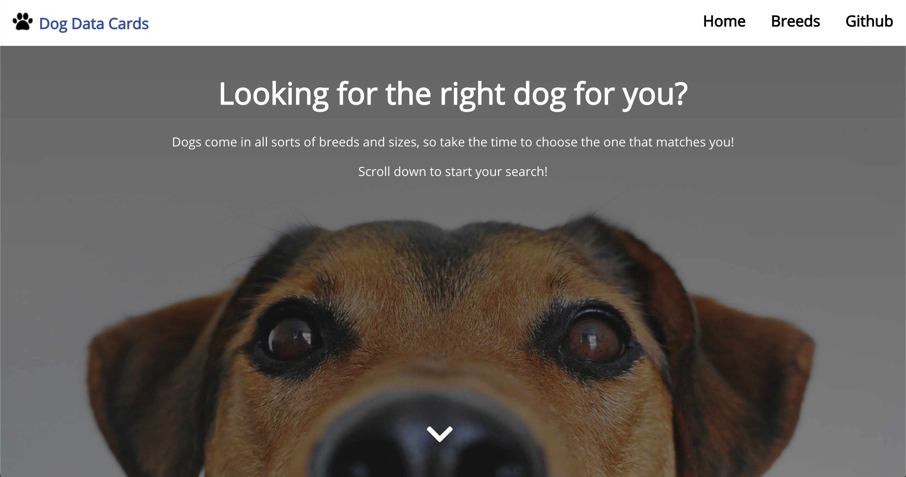
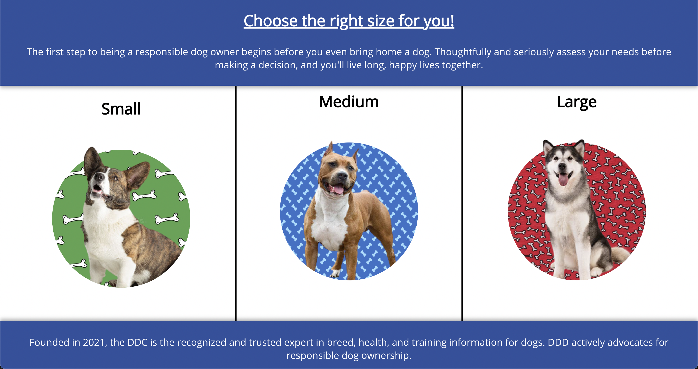
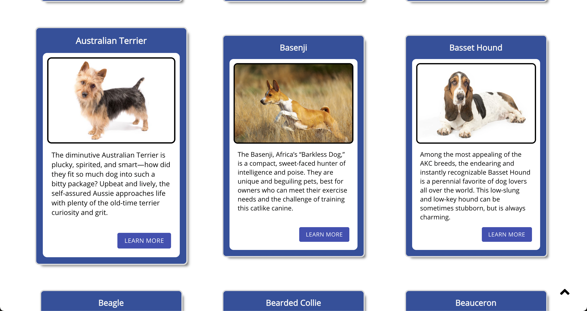
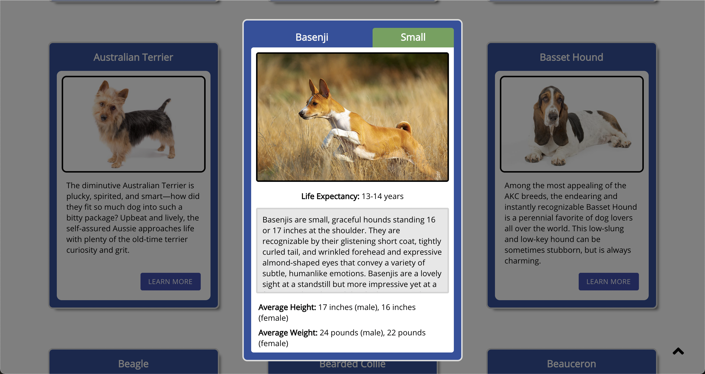

# cv-ddd
Information dog website to help user narrow down what type of dog breed they may want to adopt. Built with Postgres, Express, React and Node. 

* Data scraped from akc.org
* Icons from flaticon.com
* Wdigets and such from Material.UI

